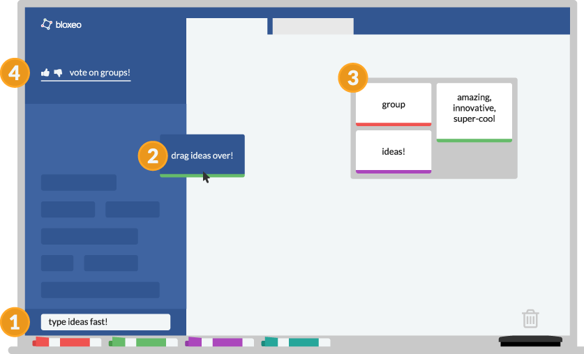

Title: bloxeo

#About Bloxeo
Bloxeo is the product of a Reasearch Studio class. About 25 students including designers, front end developers and back end developers collaborated using current industry standard practices to formulate an idea for what we wanted to make, plan it's creation and then execute that plan. Bloxeo is a web app that allows small groups to quickly and effectively brainstorm an idea. Our main demographic was students such as ourselves and hackathon attendees. I was the Gitmaster and part of the Front-End development team.

#Technologies Used
- git
- GitHub
- slack
- Javascript
- React.js
- D3.js
- waffle.io
- CircleCI
- agile (scrum)
