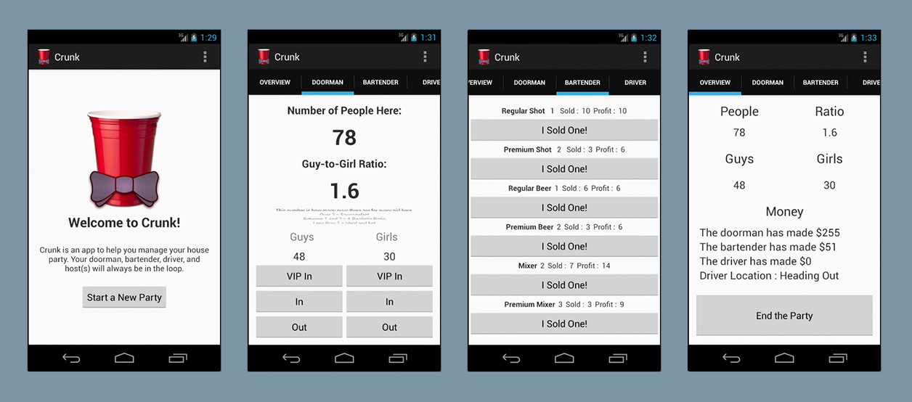

Title: crunk

#About Crunk
Crunk was a final project for a programming class, and the first large class project that I had free reign to do whatever I wanted with. My good friend Chris Knepper and I lived in a large but run down house at the time, and often threw large house parties. We realized we could write and app to help us run our parties and get course credit. The app allows users to be the Doorman, Bartender, Driver or Observer of a party. When a new party is created, the door and drink prices are set and users are delagated a role by the creator of the party. Each users input data is aggregated for all to see on the Overview.

#Technologies and Techniques Used
- Android
- Java
- XML
- eclipse