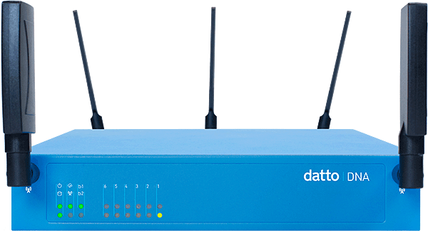

Title: dna

#About DNA
The DNA Router is a product of Datto Inc. that I worked on as an intern. The goal of the project is to create a cloud managed router for small businesses with a revolutionarily easy to use UI. I was responsible for implementing front end features of the router's interface page, and often worked with the UX designer to refine componenets.

#Technologies Used
- git
- GitHub
- slack
- Javascript
- Backbone.js
- D3.js
- LESS
- agile (scrum)
