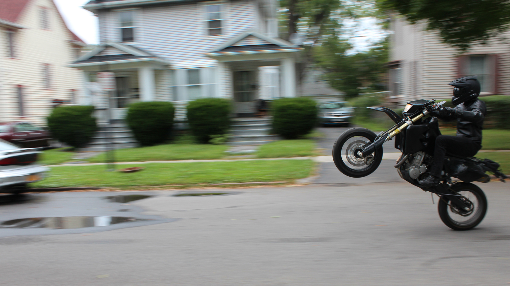

Title: about
save_as: index.html

#About me
My name is Dustin Raimondi. I like computers and motorcycles.

I am a senior Rochester Institute of Technology for New Media Interactive Development. NMID means "web design and development, but that's not broad enough so we're going to teach you mobile and native application design and development too". I like what I do and I love RIT.

I sort of became a NodeJS developer by accident, the last internship I had was using Backbone and the last few larger projects I did were using React or just Javascript. I'm primarily a front-end guy, but I'm cognizant of the back-end landscape, I run the server this website is running on with my own LEMP stack.
