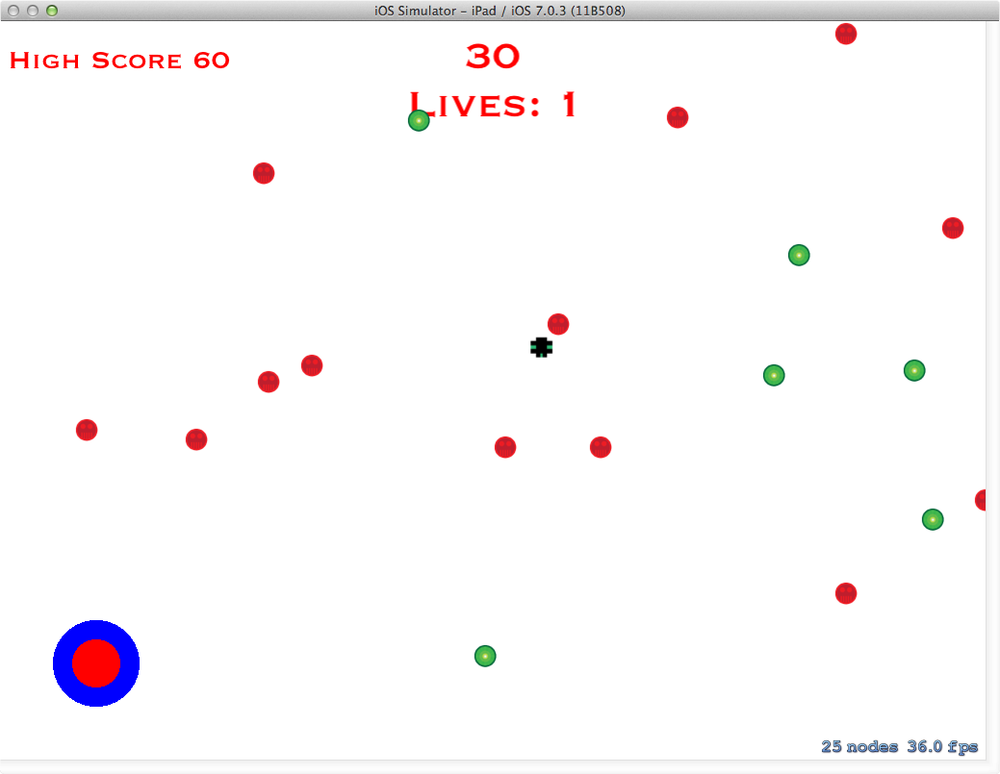

Title: UBF

#About Unforgettable Breakdancing Fiesta

Unforgettable Breakdancing Fiest - the name is long, I know - was a group project between Gary Porter, Tyler Sposato and myself. Gary and I were the developers and Tyler was the artist, we made design decisions as a group. The game is for iPad, and the premise is that you dodge the red balls, and collect the green balls to earn points. There are four power ups: slow motion, split balls, invincibility and freeze time. The player is controlled using a virtual joystick

#Technologies and Techniques Used
- iOS
- Objective C
- SpriteKit
- xCode